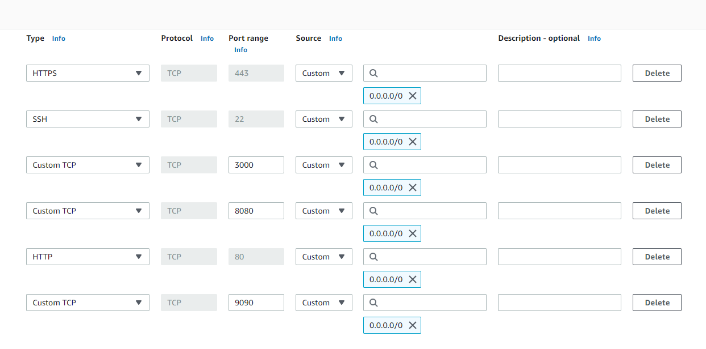

# Monitoramento do Jenkins com 
Aplicação de monitoramento do Jenkins com o Grafana + Prometheus

## Tecnologias usadas
- AWS: EC2
- Jenkins v2.401.2
- Docker
- Grafana
- Prometheus
- VSCode

## Instâncias
Criação de instâncias EC2 na AWS para provisionar as aplicações
- Abrir o [AWS Console](https://signin.aws.amazon.com/)
- Acessar o EC2
    Console Home > EC2 > EC2 Dashboard > Instances
- Subir 2 instâncias
    - 1 para o Jenkins
    - 1 para rodar o Grafana e o Prometheus

**Configuração (free tier)**
```
- Amazon Linux 2023
- x86_64
- t2.micro
- Criar uma key pair
- Criar um Security Group se não tiver configurado
```

### Configuração do Security Group
EC2 > Network & Security > Security Groups > Create security group
**Inbound rules**


## Docker
Realizar a configuração do Docker nas 2 instâncias criadas
<br>
Verificar a instalação do Docker
`docker --version`

### Instalação
Instalar
`sudo yum install -y docker`
Verificar a instalação
`docker --version`
Executar o Docker
`sudo service docker start`
Confimar se está em execução
`sudo docker info`

## Jenkins
Configuração do Jenkins no EC2
- Acessar a instância do Jenkins com o PuTTY
- Subir a imagem do Jenkins com o Docker
`sudo docker run --name=jenkins -p 8080:8080 -p 50000:50000 jenkins/jenkins:lts`
- Copiar a senha de admin
- Abrir a url na porta 8080 (Public IPv4 DNS)
- Instalar com os Plugins sugeridos

### Instalação de Plugins
Instalar os plugins extras para o uso do Prometheus

**Plugins**
- Prometheus metrics plugin
- CloudBees Disk Usage Simple Plugin

## Grafana
Configuração do Grafana no EC2
- Acessar a instância do Grafana com o PuTTY
- Subir a imagem do Grafana com o Docker
`sudo docker run --name=grafana -p 3000:3000 grafana/grafana:latest`
- Entrar na url (porta 3000) e testar se está funcionando
```
User: admin
Password: admin
```

## Prometheus
### Jenkins
- Abrir as configurações do Jenkins
Painel de controle > Gerenciar Jenkins > System > Prometheus
`Collecting metrics period in seconds: 5`
- Abrir a url do jenkins com /prometheus
Ex.: https://jenkins.com/prometheus/

### Instância do Grafana
Entrar no servidor do Grafana

- Criar um arquivo
`vi prometheus.yml`

- Criar um docker pra rodar a imagem
`sudo docker run --name=prometheus -d -p 9090:9090 -v ./prometheus.yml:/etc/prometheus/prometheus.yml prom/prometheus`

- Testar a url com a porta 9090
- Abrir o **Grafana**
Home > Connections > Data sources > Prometheus
`Prometheus server URL: http://localhost:9090`
`Save & test`

- Criar um novo Dashboards
    - Import dashboard: 9964

---

## Referências
:link: [How to Monitor Jenkins With Grafana and Prometheus](https://youtu.be/3H9eNIf9KZs) <br>
:link: [Gist with commands and more documentation](https://gist.github.com/darinpope/1c8422fb7512411760ccb2827d82613f) <br>
:link: [Installing docker-compose on Amazon EC2 Linux 2. 9kb docker-compose file](https://stackoverflow.com/questions/63708035/installing-docker-compose-on-amazon-ec2-linux-2-9kb-docker-compose-file) <br>
:link: [Jenkins: Performance and Health Overview](https://grafana.com/grafana/dashboards/9964-jenkins-performance-and-health-overview/)